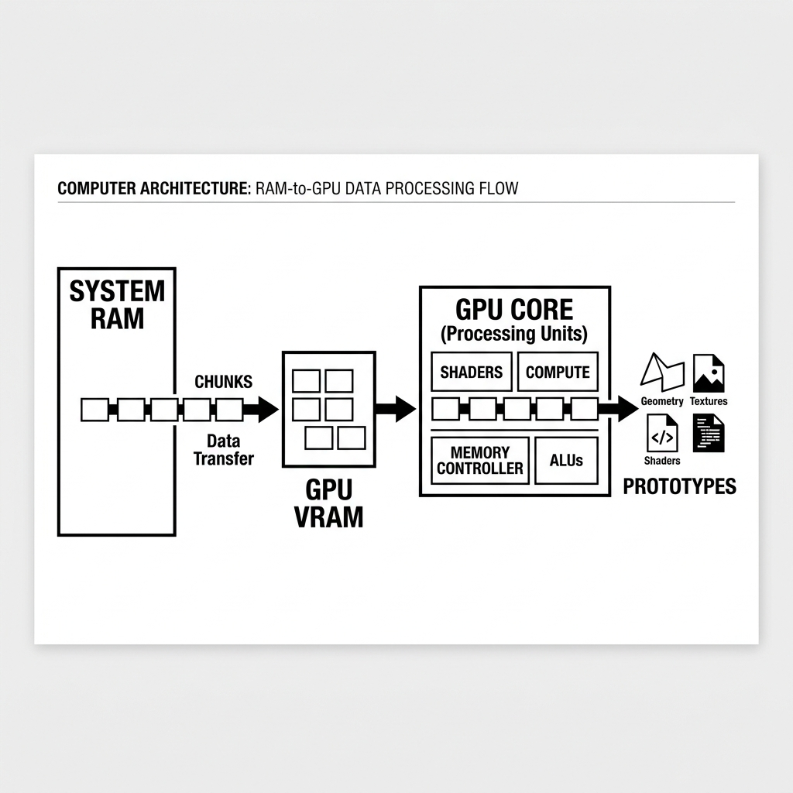
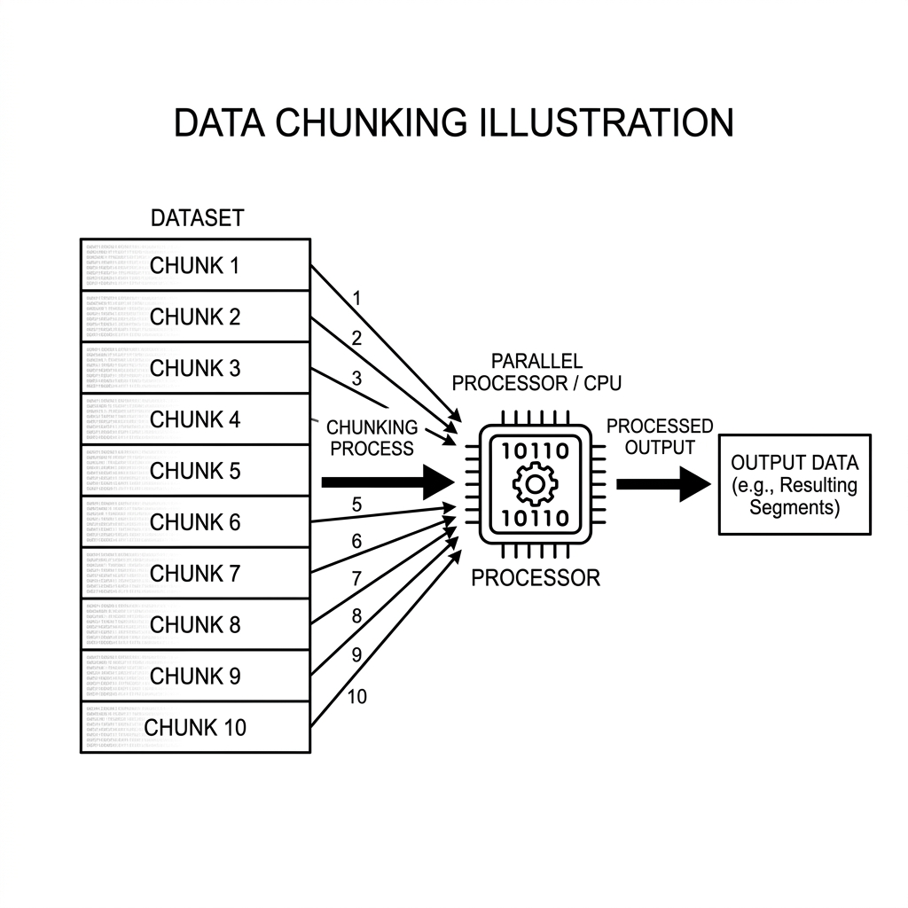
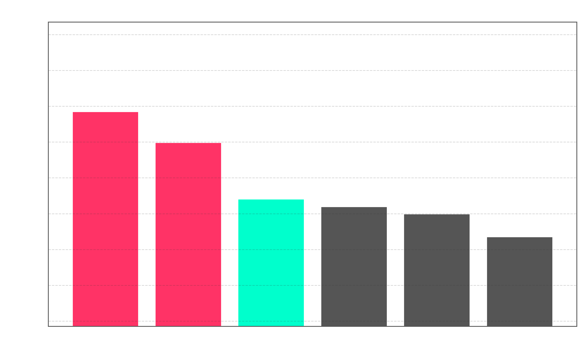
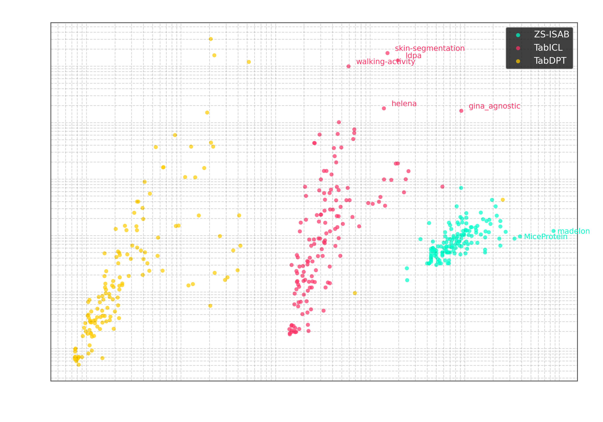

# ZS-ISAB: Zero-Shot ISAB Architecture

**Author:** Thanniru Sai Teja ([@iam-saiteja](https://github.com/iam-saiteja))  
**Repository:** [https://github.com/iam-saiteja/Zero-Shot-TabPFN](https://github.com/iam-saiteja/Zero-Shot-TabPFN)

This repository contains the official implementation of **ZS-ISAB** (Zero-Shot Induced Set Attention Block) for TabPFN, a mathematical wrapper that allows pre-trained tabular foundation models to evaluate massive tabular datasets on entry-level consumer hardware by eliminating the $\mathcal{O}(N^2)$ VRAM bottleneck without fine-tuning or retraining.

---

## 🏛️ Architecture Overview

Vanilla TabPFN relies on standard self-attention mechanisms with an $\mathcal{O}(N^2)$ memory footprint, forcing it to project all $N$ dataset rows simultaneously into the GPU VRAM. This causes vanilla TabPFN to crash with `CUDA Out Of Memory` errors on just 16,384 rows on consumer GPUs.

Our **ZS-ISAB** architecture solves this natively inside the computational graph:



### 1. Tag-Team Memory Hierarchy & Streaming Data Chunking
Instead of pushing the entire dataset to the GPU, ZS-ISAB retains the dataset safely in **System RAM**. The architecture dynamically pipes small blocks ($B = 16{,}384$ rows) into the **GPU VRAM**, accumulates the necessary attention projections using an Online Softmax Accumulator (adapted from FlashAttention), and clears intermediate allocations. Peak GPU VRAM usage stays strictly flat.



### 2. $\mathcal{O}(NM)$ Computational Scaling via Seeded Anchors
ZS-ISAB routes attention through $M = 512$ actual anchor rows sampled from the training set via a seeded permutation (`seed=42`). This completely avoids the representation collapse caused by averaged token embeddings.

---

## 📊 Benchmark Results & Leaderboards

### 1. Extreme Row Limit Test (RTX 3090 Ti Server)
- **Vanilla TabPFN Limit:** $\sim$16,384 rows
- **ZS-ISAB Limit:** **1,257,500 rows** (evaluated in 8.9 seconds)
- **Scaling Factor:** **76.8$\times$ larger context** on identical consumer hardware!

### 2. TabZilla 168-Dataset Suite (True Expected Performance)
Evaluating across **168 TabZilla datasets** using true expected mean performance across random search trials:

| Rank | Model | Mean Accuracy | Zero-Shot / Tuned |
|:---:|:---|:---:|:---:|
| 1 | XGBoost | 0.8370 | Tuned (HPO) |
| 2 | CatBoost | 0.8197 | Tuned (HPO) |
| 🥇 **3** | **TabPFN ZS-ISAB (Ours)** | **0.7881** | **Pure Zero-Shot** |
| 4 | LightGBM | 0.7839 | Tuned (HPO) |
| 5 | RandomForest | 0.7799 | Tuned (HPO) |
| 6 | LinearModel | 0.7671 | Tuned (HPO) |




### 3. Tabular Foundation Model (TFM) Arena (142 Datasets Head-to-Head)
- **Mean ROC AUC:** **0.9272** (1st place among TFMs, vs TabDPT 0.9182, TabICL 0.9146)
- **Win Rate:** **69.0%** best-or-tied across all 3-way comparisons.
- **CUDA OOMs:** **0 crashes** across all datasets.

---

## ⚡ Quickstart

```python
from tabpfn import TabPFNClassifier
from zsisab.wrapper import inject_zsisab

# 1. Inject the ZS-ISAB architecture globally
inject_zsisab(num_prototypes=512, chunk_size=16384)

# 2. Use TabPFN exactly as normal with 1M+ row scalability!
clf = TabPFNClassifier(device='cuda', N_ensemble_configurations=32)
clf.fit(X_train, y_train)
probs = clf.predict_proba(X_test)
```

---

## 📦 Raw Benchmark Datasets & Artifacts

- **Suite 1 (TabZilla 168 Datasets, 46,409 JSONs):** `tabzilla_168_datasets_raw_results.zip`
- **Suite 2 (TFM Arena & Scaling Logs):** `tfm_arena_and_extreme_scaling_results.zip`