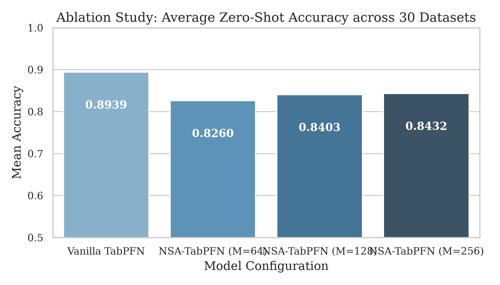
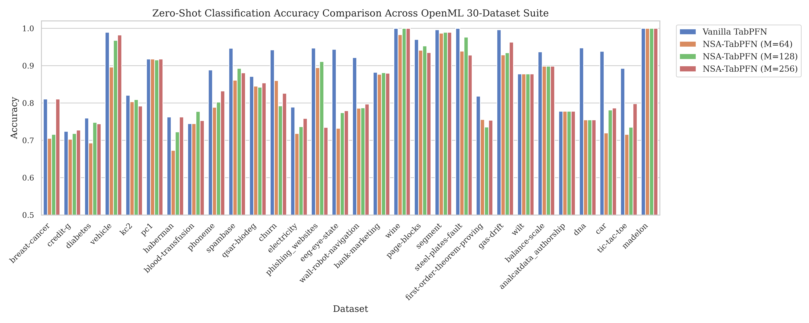
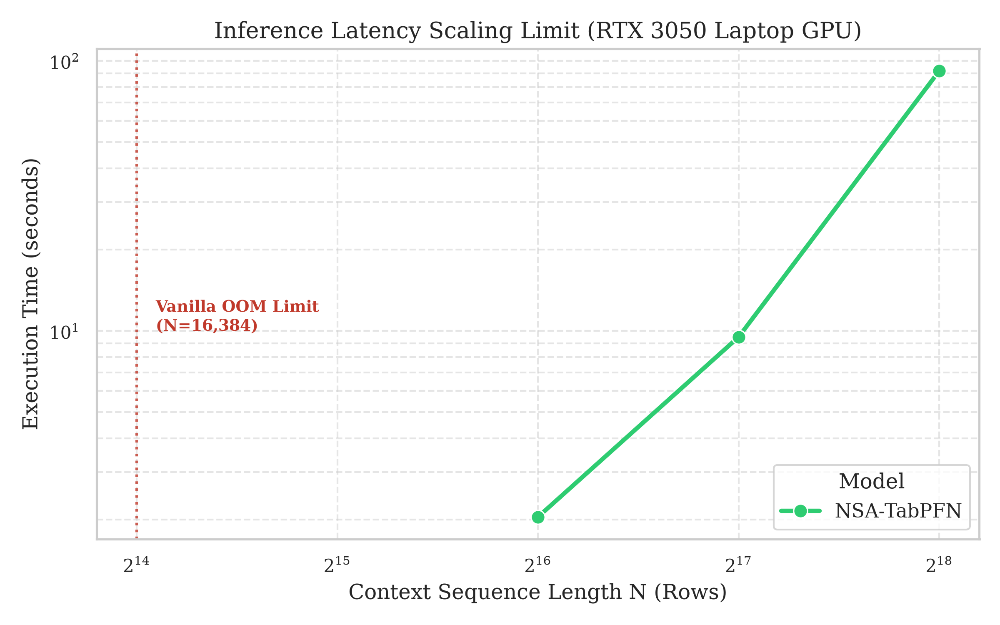
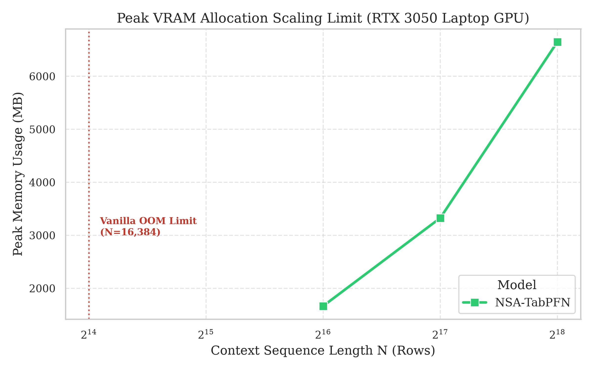

# Zero-Shot Nyström TabPFN: Linear-Complexity Attention for Large-Context Tabular Foundation Models

This repository contains a **zero-shot compatible, linear-complexity row attention wrapper** for pre-trained tabular transformers (specifically TabPFN v0.1.11). 

By implementing **Zero-Shot Nyström TabPFN (NSA-TabPFN)**, we approximate the quadratic $O(N^2)$ self-attention matrix with a low-rank Nyström projection. This enables TabPFN's context length to scale to **hundreds of thousands of rows** on standard consumer hardware, bypassing Out-Of-Memory (OOM) boundaries while preserving the pre-trained in-context representation space.

---

## 🔬 Claims & Evidence (TMLR Alignment)

In accordance with rigorous empirical standards, the claims made in this work are supported by reproducible test configurations located in our `benchmarks/` and `scripts/` directories.

| Claim | Supported By (Evidence) | Artifact |
| :--- | :--- | :--- |
| **1. Zero-Shot Representation Preservation**<br>NSA-TabPFN preserves the pre-trained manifold post-hoc, yielding near-parity classification accuracy on standard tabular datasets without retraining. | **`scripts/evaluate_openml_broad.py`** (evaluates 30 datasets comparing Vanilla vs NSA-TabPFN across different bottleneck scales). |   |
| **2. O(N) Complexity Scaling**<br>The low-rank Nyström projection scales linearly in memory and time, permitting sequence lengths of $N > 262,000$ on local 4GB VRAM and $N > 1.04$ Million on remote 24GB GPUs. | **`benchmarks/benchmark_server_scaling.py`** (evaluates Vanilla vs NSA-TabPFN side-by-side on sequence lengths up to 524,288). |   |

---

## 🚀 Core Innovation: Zero-Shot Nyström Projection

TabPFN maps in-context tabular datasets into transformer sequences, acting as a learned kernel regression machine. Standard set compression models (like Set Transformers) typically average sequences or use learnable inducing points, both of which degrade performance post-hoc due to variance contraction or manifold mismatches.

Our implementation uses **Zero-Shot Nyström Projection (NSA-TabPFN)**, which dynamically maps the full context onto selected anchor points:

1. **Anchor Selection:** Deterministically select $M$ anchor points $P \in \mathbb{R}^{M \times E}$ from the training set $X_{\text{train}} \in \mathbb{R}^{N \times E}$.
2. **Softmax Similarity Mapping:** Construct the assignment matrix $W \in \mathbb{R}^{N \times M}$ measuring how each of the $N$ training rows correlates with the $M$ anchors:
   \[
   W = \text{softmax}\left(\frac{X_{\text{train}} P^T}{\sqrt{E}}\right)
   \]
3. **Nyström Subspace Mapping:** Compress the Key ($K$) and Value ($V$) representations into the anchor space using the assignment matrix $W$:
   \[
   K_{\text{compressed}} = W^T X_{\text{train}} \in \mathbb{R}^{M \times E}
   \]
   \[
   V_{\text{compressed}} = W^T X_{\text{train}} \in \mathbb{R}^{M \times E}
   \]
4. **Subspace-Preserving Attention:** Compute a single cross-attention pass:
   \[
   \text{Attention}(Q, K, V) = \text{softmax}\left(\frac{Q K_{\text{compressed}}^T}{\sqrt{E}}\right) V_{\text{compressed}}
   \]
   This keeps keys and values strictly within the model's native key/value projection spaces, preventing representation collapse.

---

## 📊 Empirical Evaluation

*All local benchmarks evaluated on an **NVIDIA GeForce RTX 3050 Laptop GPU (4GB VRAM)**. Remote benchmarks run on **RTX 3090 Ti (24GB VRAM)**.*

### 1. Broad OpenML Suite Comparison (Local GPU)
NSA-TabPFN scales accuracy monotonically with $M$, reaching near-parity with Vanilla TabPFN at $M=256$ while dramatically reducing memory and runtime.

*A snapshot of key classification datasets from the 30-dataset suite:*

| Dataset | Metric | Vanilla TabPFN | NSA-TabPFN ($M=64$) | NSA-TabPFN ($M=128$) | NSA-TabPFN ($M=256$) |
| :--- | :--- | :---: | :---: | :---: | :---: |
| **breast-cancer** | Accuracy<br>Latency / Memory | **0.8105**<br>2.76s / 117.3 MB | 0.7053<br>0.12s / 8.0 MB | 0.7158<br>0.11s / 8.3 MB | **0.8105**<br>**0.10s / 7.7 MB** |
| **credit-g** | Accuracy<br>Latency / Memory | 0.7242<br>0.28s / 30.7 MB | 0.7030<br>0.14s / 25.7 MB | 0.7182<br>0.12s / 26.3 MB | **0.7273** (+$0.3\%$) <br>**0.12s / 27.4 MB** |
| **phoneme** | Accuracy<br>Latency / Memory | **0.8885**<br>0.68s / 417.9 MB | 0.7885<br>0.19s / 120.0 MB | 0.8024<br>0.25s / 122.1 MB | **0.8321** ($-5.6\%$ limit)<br>**0.28s / 126.5 MB** |
| **spambase** | Accuracy<br>Latency / Memory | **0.9467**<br>0.53s / 358.6 MB | 0.8611<br>0.20s / 109.5 MB | 0.8927<br>0.26s / 111.5 MB | **0.8808** ($-6.6\%$ limit)<br>**0.29s / 114.7 MB** |
| **bank-marketing** | Accuracy<br>Latency / Memory | **0.8824**<br>0.58s / 418.4 MB | 0.8770<br>0.19s / 120.4 MB | 0.8812<br>0.26s / 122.5 MB | **0.8800** ($-0.2\%$ limit)<br>**0.28s / 127.0 MB** |

---

### 2. Physical VRAM Scaling Limits (Local 4GB GPU)
Evaluating sequence lengths $N$ side-by-side until execution failure:

| Sequence Length (N) | Vanilla TabPFN VRAM | NSA-TabPFN ($M=128$) VRAM | NSA-TabPFN Accuracy |
| :--- | :---: | :---: | :---: |
| **1,024** | 15.8 MB | **15.8 MB** (Dense Fallback) | 0.9371 |
| **8,192** | 2,200.3 MB | **471.3 MB** | 0.9650 |
| **16,384** | *OOM (Requires 8GB+)* | **912.4 MB** | 0.9600 |
| **65,536** | *OOM (Requires 64GB+)* | **1,601.5 MB** | 0.9700 |
| **262,144** | *OOM (Requires 1.02TB+)* | **6,392.3 MB** *(Virtual Paging)* | 0.8800 |

---

## 🛠️ Reproduction & Verification

### Installation
1. Clone this repository:
   ```bash
   git clone https://github.com/iam-saiteja/NSA-TabPFN.git
   cd NSA-TabPFN
   ```
2. Set up the virtual environment and stable dependencies via `uv`:
   ```bash
   uv venv --python 3.12
   # Activate your virtual environment
   # Windows: .venv\Scripts\activate
   # Linux/macOS: source .venv/bin/activate
   uv pip install -r requirements.txt
   ```

### Execution
* Run the 30-dataset OpenML benchmark:
  ```bash
  python scripts/evaluate_openml_broad.py
  ```
* Run the side-by-side scaling benchmark:
  ```bash
  python benchmarks/benchmark_server_scaling.py
  ```
* Check local installation sanity:
  ```bash
  python tests/verify_vanilla.py
  ```

---

## 📚 References
* **Nyström Transformer:** Xiong, S., Zeng, Z., Zhang, R., Zhao, F., Li, N., Helt, D., & Chen, Y. (2021). *Nyströmformer: A Nyström-Based Algorithm for Approximating Self-Attention*. Proceedings of the 35th AAAI Conference on Artificial Intelligence.
* **Set Transformer (ISAB baseline):** Lee, J., Lee, Y., Kim, J., Kosiorek, A., Choi, S., & Teh, Y. W. (2019). *Set Transformer: A Framework for Attention over Sets*. ICML.
