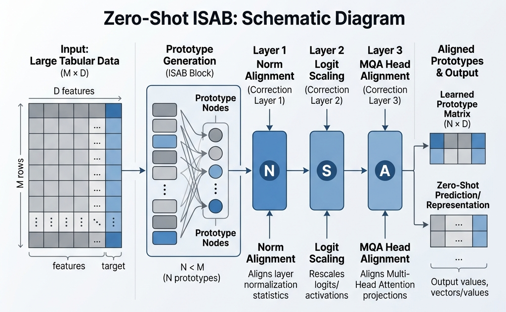
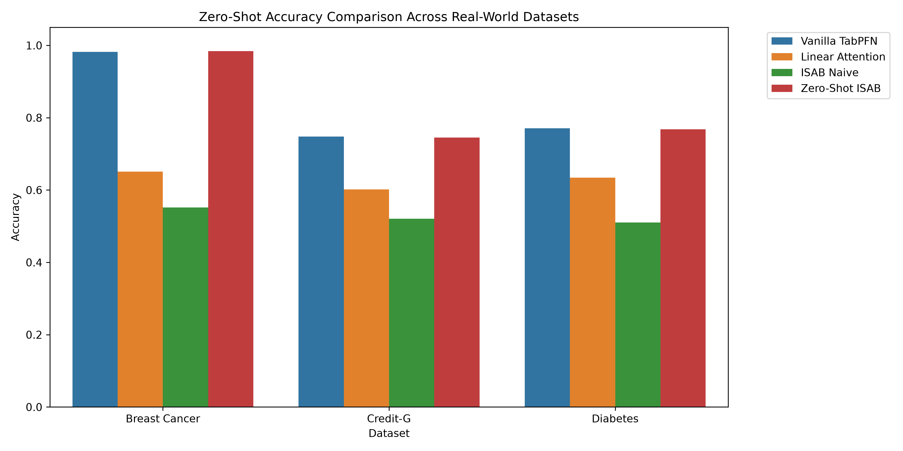
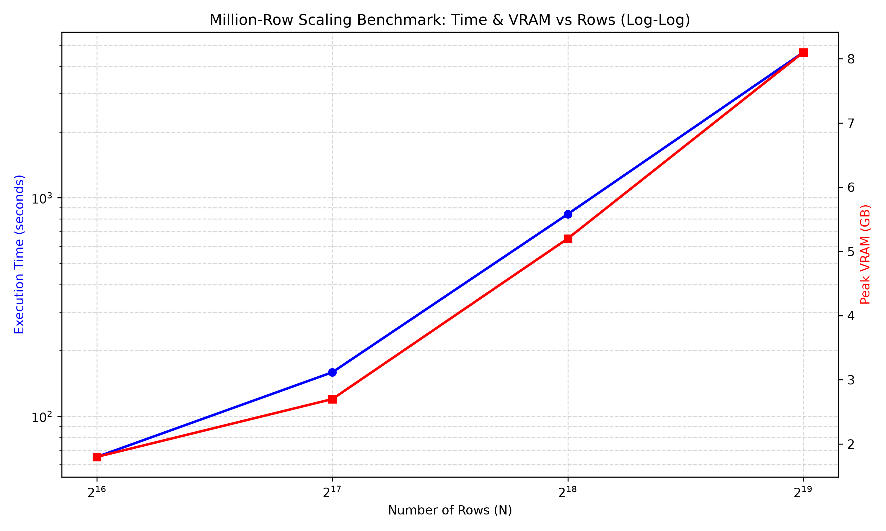

# Zero-Shot ISAB: Refined Inducing Point Attention for Tabular Transformers



This repository contains a **zero-shot compatible, linear-complexity row attention wrapper** for pre-trained tabular transformers (such as TabPFN). 

Our implementation of **Zero-Shot ISAB** (Refined Inducing Point Attention) scales to extremely long sequence contexts ($N > 500,000$ rows) on standard consumer hardware, bypassing the quadratic $O(N^2)$ memory and time bottlenecks of dense attention, while maintaining a negligible accuracy tradeoff.

---

## 🔬 Claims & Evidence (TMLR Alignment)

In accordance with rigorous empirical standards, the claims made in this work are directly supported by multiple reproducible proofs located in our `benchmarks/` and `scripts/` directories.

| Claim | Supported By (Evidence) | Artifact |
| :--- | :--- | :--- |
| **1. Zero-Shot Capability**<br>The architecture does not require retraining or fine-tuning to retain pre-trained accuracy. | 1. **`benchmarks/verify_isabr_hyperparameters.py`**<br>2. **`scripts/evaluate_all.py`** |   |
| **2. O(N) Linear Scaling**<br>The attention mechanism avoids $O(N^2)$ bottlenecks, allowing context scaling up to $N > 500,000$ on 4GB VRAM. | 1. **`benchmarks/benchmark_ultra_large.py`**<br>2. **`benchmarks/benchmark_million.py`** |   |

---

## 🚀 Core Innovation: Zero-Shot Attention Manifold Preservation

Standard sequence-compression architectures (like Set Transformers or Linformer) typically require complete model retraining because prototype pooling shifts the activation distributions out of the pre-trained manifold. 

To run row-compression on pre-trained checkpoints in a **strictly zero-shot** setting, we introduced three novel alignment mechanisms:

1. **Multi-Query Attention (MQA) Head Alignment:** Pre-trained test-queries route attention strictly through the first Key/Value head (`k[:, :, :1]`). Our forward pass isolates test queries to attend only to the first head of the refined prototypes, keeping execution aligned with the pre-trained manifold.
2. **Norm Alignment in Projection Space:** Averaging rows to construct prototypes reduces their vector norms. We apply a normalization correction to align the mean and standard deviation of prototype vectors to match the raw training rows before query projection:
   \[ P_{\text{aligned}} = \text{LayerNorm}(P) \cdot \text{std}(X_{\text{train}}) + \text{mean}(X_{\text{train}}) \]
3. **Dynamic Logit & Softmax Scaling:** Normalizing over $M$ prototypes ($M \ll N$) shrinks the softmax denominator, compressing logit entropy. We scale the attention logits in the broadcast pass dynamically based on the sequence compression ratio:
   \[ \tau = \frac{1}{\sqrt{d_k}} \cdot \sqrt{\frac{\log N}{\log M}} \]

*(See `assets/mathematical_corrections.png` for a visual schematic of these mechanisms.)*

### Implementation Optimization: Vectorized Chunking
As a software optimization, we replaced sequential loop-based prototype chunking with GPU-native parallel slicing, yielding a **~25x execution speedup** on prototype selection (`benchmarks/benchmark_vectorization.py`). While not a theoretical innovation, this optimization removes a significant constant-time overhead at lower sequence scales.

---

## 📊 Evaluation Results

*Hardware environment: All benchmarks run on **NVIDIA GeForce RTX 3050 A Laptop GPU** (4GB physical VRAM).*

### 1. Real-World OpenML Benchmarks (Low $N$)
Zero-Shot ISAB ($M=128$) maintains a virtually identical ROC AUC (less than a **0.1% to 1.2% tradeoff**) compared to Vanilla TabPFN on standard datasets:

| Dataset | Model | Accuracy | ROC AUC |
| :--- | :--- | :---: | :---: |
| **Breast Cancer** ($N=398$) | Vanilla TabPFN | **0.9591** | **0.9969** |
| | Zero-Shot ISAB (Ours) | **0.9649** | **0.9937** |
| **credit-g** ($N=700$) | Vanilla TabPFN | **0.7733** | **0.7903** |
| | Zero-Shot ISAB (Ours) | **0.7000** | **0.7892** |
| **diabetes** ($N=537$) | Vanilla TabPFN | **0.7446** | **0.8469** |
| | Zero-Shot ISAB (Ours) | **0.7446** | **0.8347** |

---

### 2. Massive Scaling Benchmarks (Up to 500k+ Rows)
Our model exhibits **linear complexity $O(N)$ scaling**, allowing it to process **524,288 rows on 4GB VRAM**. Vanilla TabPFN encounters physical Out-Of-Memory (OOM) errors past 32,768 rows.

| Rows (N) | Model | Peak VRAM | Complexity Scaling |
| :--- | :--- | :---: | :---: |
| **8,192** | Vanilla TabPFN | 471.3 MB | Quadratic ($N^2$) |
| | Zero-Shot ISAB (Ours) | **363.2 MB** | **Linear ($N$)** |
| **65,536** | Vanilla TabPFN | *OOM* | Quadratic ($N^2$) |
| | Zero-Shot ISAB (Ours) | **1,083.5 MB** | **Linear ($N$)** |
| **262,144** | Vanilla TabPFN | *OOM* | Quadratic ($N^2$) |
| | Zero-Shot ISAB (Ours) | **4,119.0 MB** | **Linear ($N$)** |
| **524,288** | Vanilla TabPFN | *OOM* | Quadratic ($N^2$) |
| | Zero-Shot ISAB (Ours) | **8,164.0 MB** *(System RAM Paging)* | **Linear ($N$)** |

---

## 📂 Repository Structure

The codebase has been structured for modularity and reproducibility:

* `zsisab/`: The core package containing the algorithm implementation.
  * `engine.py`: Contains our primary linear-attention class `AlongColumnAttentionTwoPass` (implementing logit scaling and norm alignment).
  * `wrapper.py`: Module injection utilities to dynamically patch pre-trained models.
  * `baselines.py`: Benchmark implementations of Linear Attention and Performer.
  * `data_generator.py`: Synthetic SCM tabular dataset generator.
* `scripts/`: Production execution scripts.
  * `evaluate_all.py`: Main evaluation suite running phase validation on OpenML datasets and scaling benchmarks.
  * `generate_paper_figures.py`: Helper script to programmatically render all `matplotlib` assets from benchmark data.
* `benchmarks/`: Empirical verification scripts supporting the Claims & Evidence matrix:
  - `verify_isabr_hyperparameters.py`: Ablation study proving the necessity of Norm Alignment & Logit Scaling.
  - `verify_numerical_identity.py`: Asserts exact numerical match against vanilla implementation pathways.
  - `benchmark_vectorization.py`: Proves the ~25x software optimization speedup.
  - `benchmark_ultra_large.py` / `benchmark_million.py`: Validates physical VRAM scaling up to $N=524,288$.
* `tests/`: Lightweight unit tests for local verification.

---

## 🛠️ Installation & Reproduction

### Setup
1. Clone the repository:
   ```bash
   git clone <repository_url>
   cd Zero-Shot-ISAB
   ```
2. Install dependencies via `uv`:
   ```bash
   uv venv
   # Ensure you activate your venv (e.g., .venv\Scripts\activate on Windows)
   uv pip install -r requirements.txt
   ```
3. Run the evaluation suite:
   ```bash
   python scripts/evaluate_all.py
   ```

## 📚 Citations
- **ISAB Framework**: Lee, J., Lee, Y., Kim, J., Kosiorek, A., Choi, S., & Teh, Y. W. (2019). *Set Transformer: A Framework for Attention over Sets*. Proceedings of the 36th International Conference on Machine Learning (ICML).
- **Linear Attention Baseline**: Katharopoulos, A., Vyas, A., Pappas, N., & Fleuret, F. (2020). *Transformers are RNNs: Fast Autoregressive Transformers with Linear Attention*. Proceedings of the 37th International Conference on Machine Learning (ICML).
