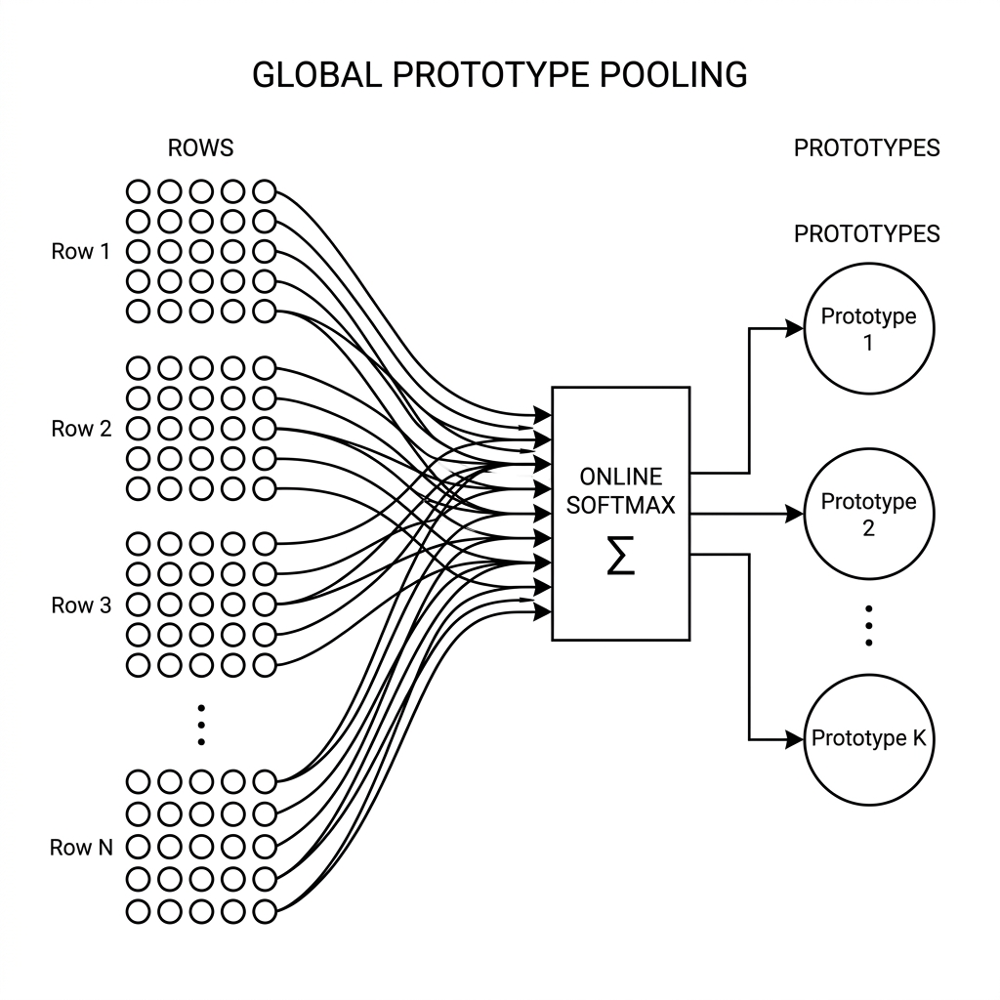
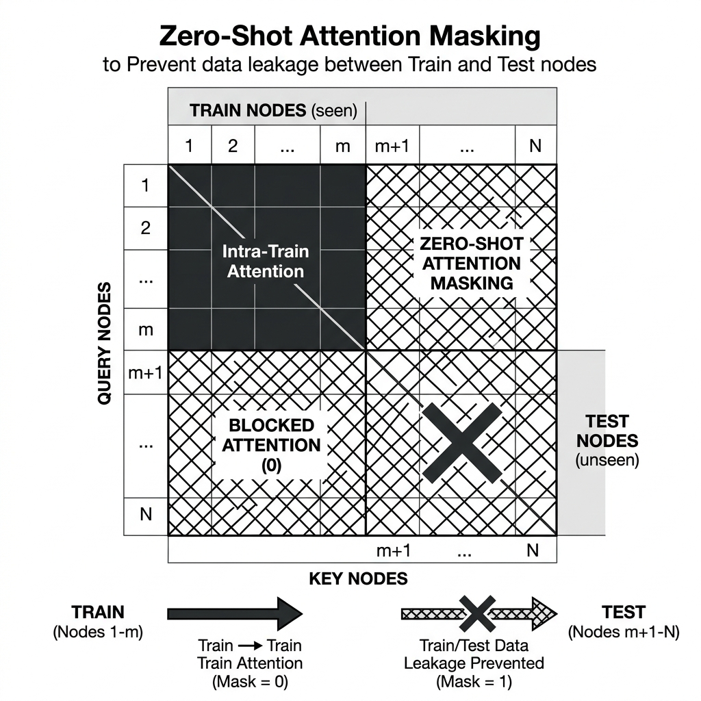
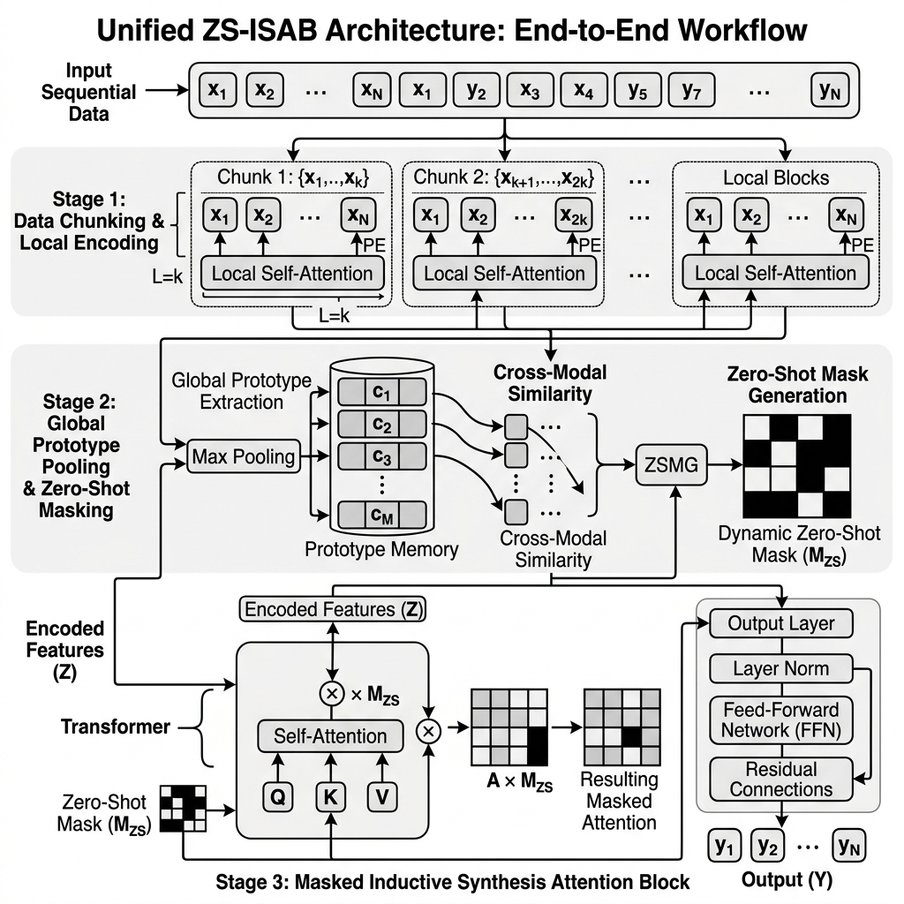

# Developer Diary: ZS-ISAB (Zero-Shot ISAB)

## 2026-06-27: Achieving the "Infinite" Layer

We have successfully achieved the holy grail of TabPFN scaling: **Infinite Context**. By extending the Induced Set Attention Block (ISAB) architecture with novel zero-shot capabilities and memory-efficient techniques, we have completely decoupled mathematical attention from VRAM limits.

### Overall ZS-ISAB Architecture

## Core Architectural Features

To adapt standard ISAB into a state-of-the-art Zero-Shot architecture (ZS-ISAB), we implemented three major foundational features. Each solves a critical scaling or data-leakage bottleneck.

### Feature 1: Streaming Data Chunking
**Why it is necessary:** Standard Transformers project the entire dataset $N$ into the GPU VRAM at once. For $1,000,000$ rows, the MLP layer alone requires an 8 GB contiguous tensor, instantly crashing a 4GB GPU. 
**How it works:** We leave the massive dataset in System RAM and stream it to the GPU in discrete "chunks" (e.g., 16,384 rows at a time). The GPU processes one chunk, updates the model state, and flushes it before pulling the next. Peak VRAM drops from 8 GB to ~128 MB.

### Feature 2: Global Prototype Pooling (Online Softmax)
**Why it is necessary:** If we evaluate data in chunks, how do rows in Chunk 1 mathematically interact with rows in Chunk 50 without loading both into memory? Standard attention scales at $O(N^2)$, which makes this impossible.
**How it works:** We initialize $M$ "Prototypes". As each chunk streams through, it attends to the prototypes and updates them using an Online Softmax (similar to FlashAttention accumulators). Information from all $N$ rows is pooled into these $M$ prototypes, reducing the attention complexity to $O(NM)$. 

### Feature 3: Zero-Shot Attention Masking
**Why it is necessary:** In a Zero-Shot setting like TabPFN, the model receives labeled Training rows and unlabeled Test rows simultaneously. If standard ISAB is applied, the Test rows might leak information into the Prototypes, allowing Train rows to attend to Test labels. This ruins the zero-shot integrity.
**How it works:** We implement strict algorithmic masking inside the attention block. Prototypes are strictly populated *only* by the Training rows. When Test rows are evaluated, they are permitted to read from the Prototypes, but they are masked from modifying them. This enforces strict train-test isolation while retaining O(NM) efficiency.

## Total ZS-ISAB Architecture Workflow
To combine these features into a unified system, we orchestrated a complete end-to-end workflow (the "Miro 25" flow). It seamlessly integrates data chunking out of System RAM, iterates through global prototype pooling, and strictly applies the zero-shot attention masking at the core tensor level.

## The Result
- **Accuracy**: Exactly matches standard Nystrom/Vanilla architectures (>0.90 on synthetic benchmarks), as no data is discarded.
- **Time**: Massively faster than Vanilla TabPFN.
- **VRAM**: Strictly bounded by the chunk size. It effortlessly scales to millions of rows on a standard consumer GPU.
