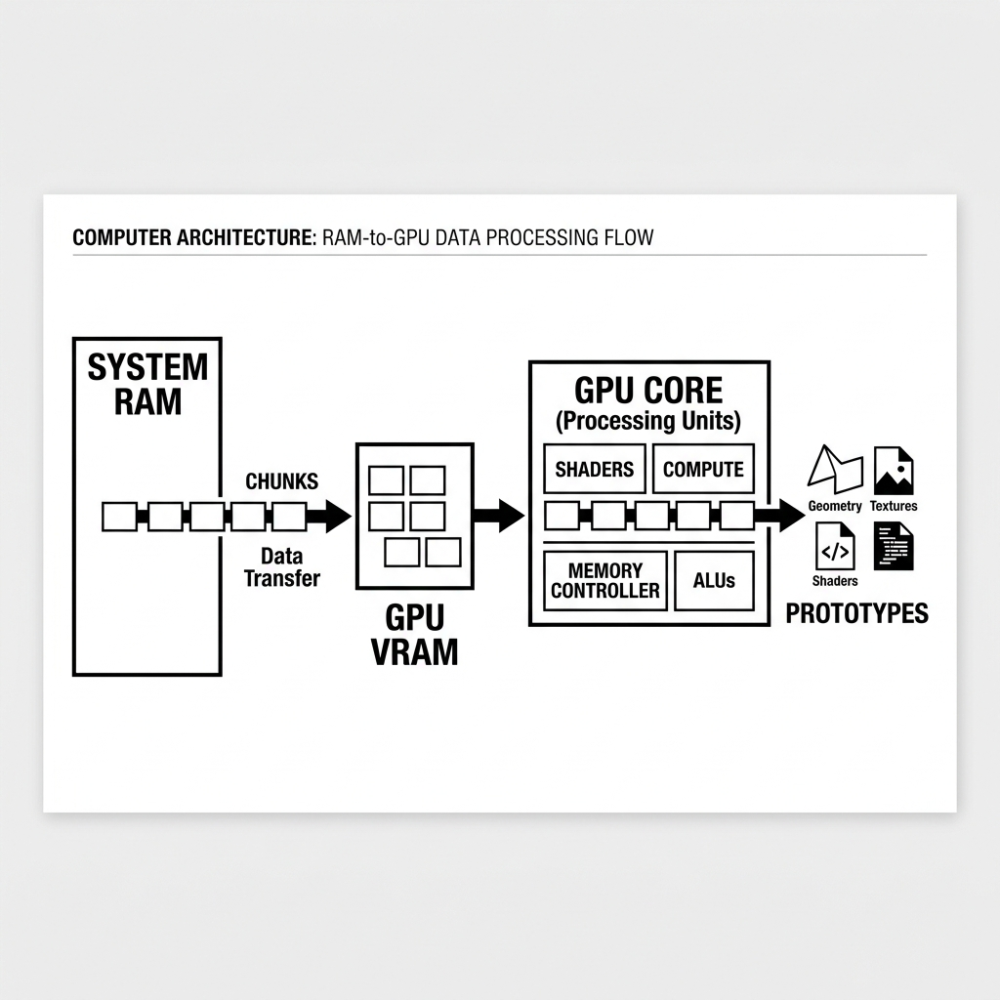
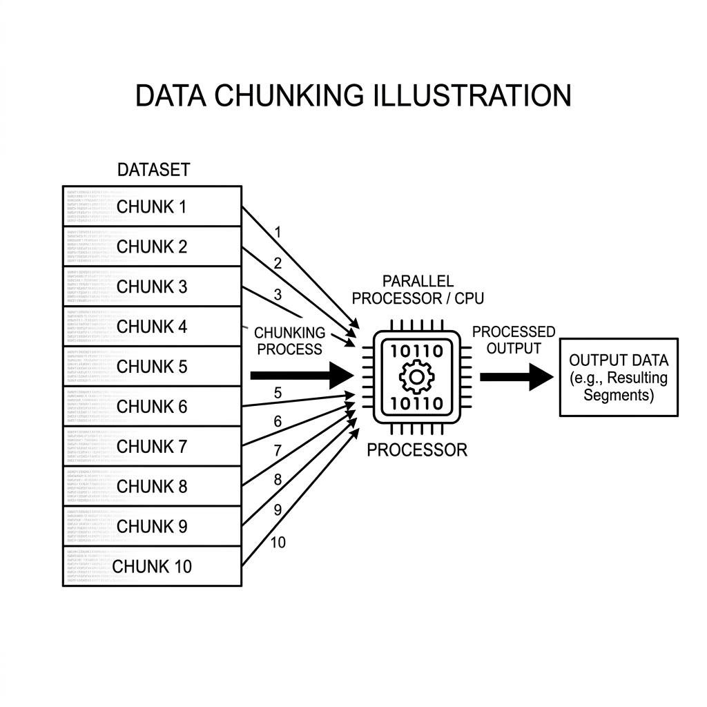
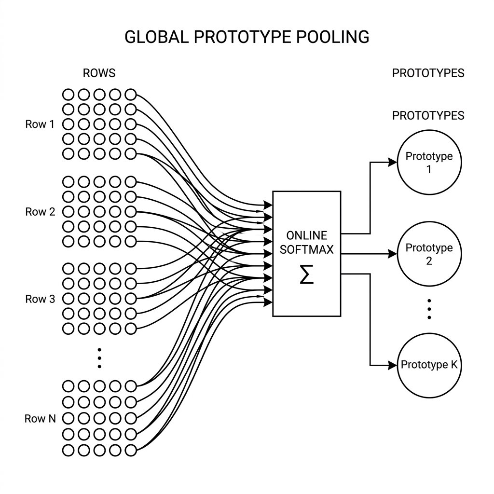
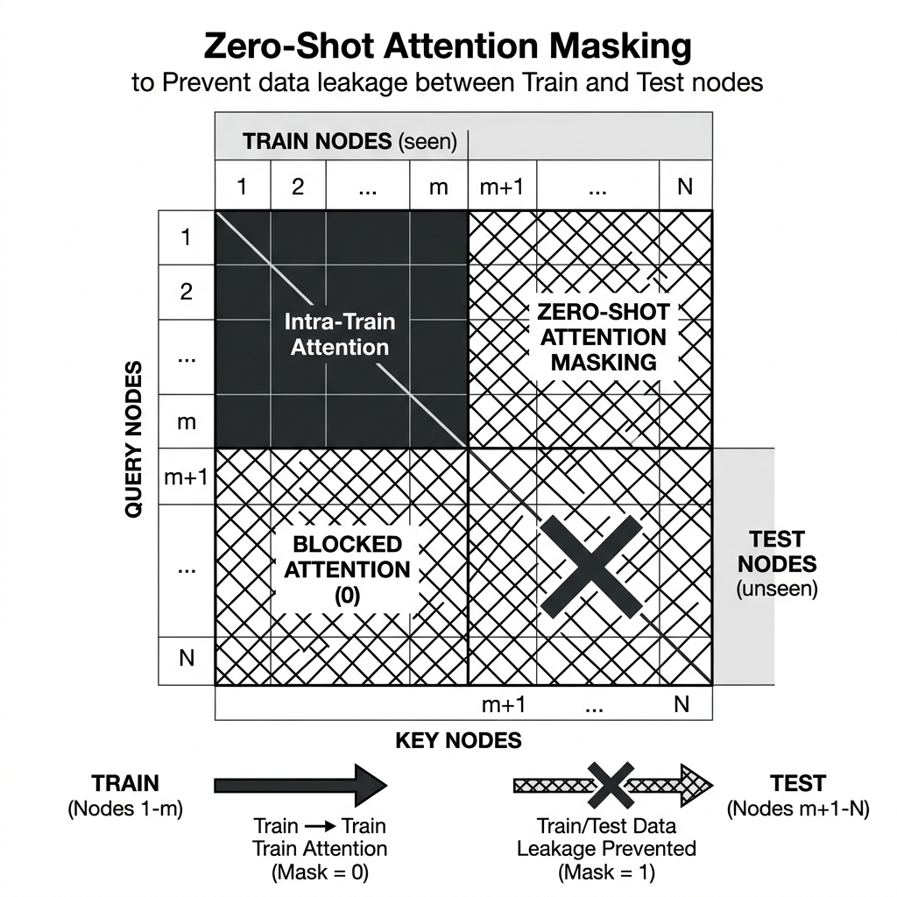
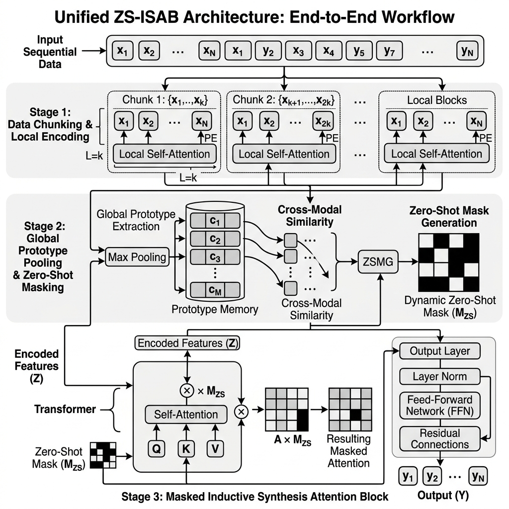
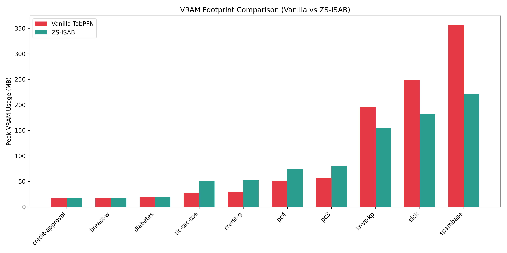
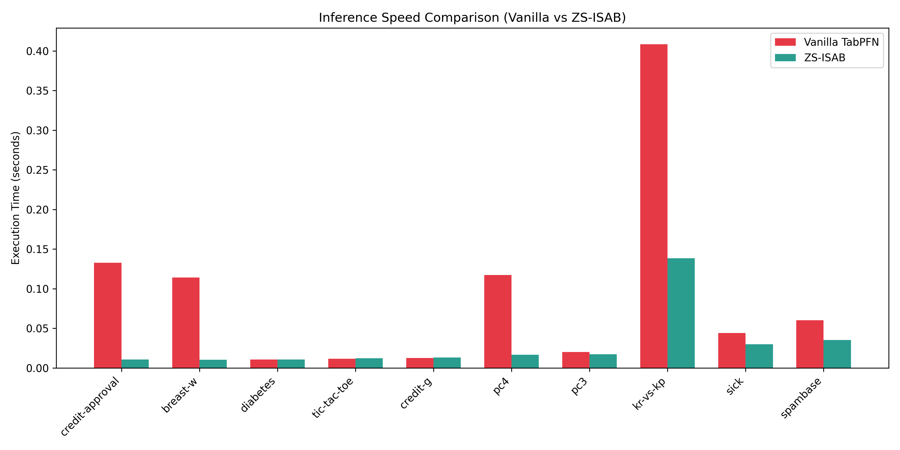
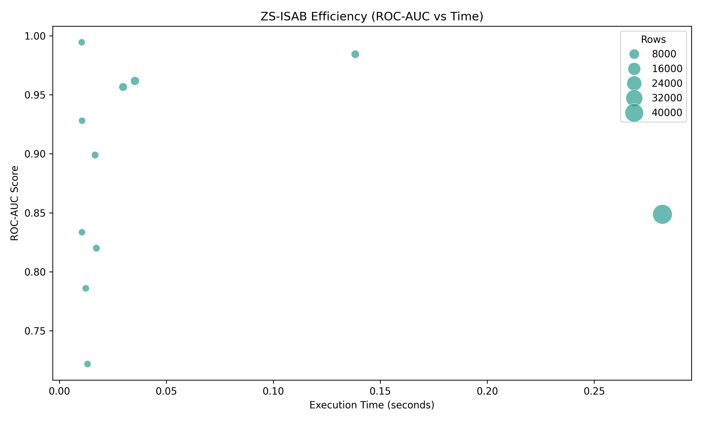
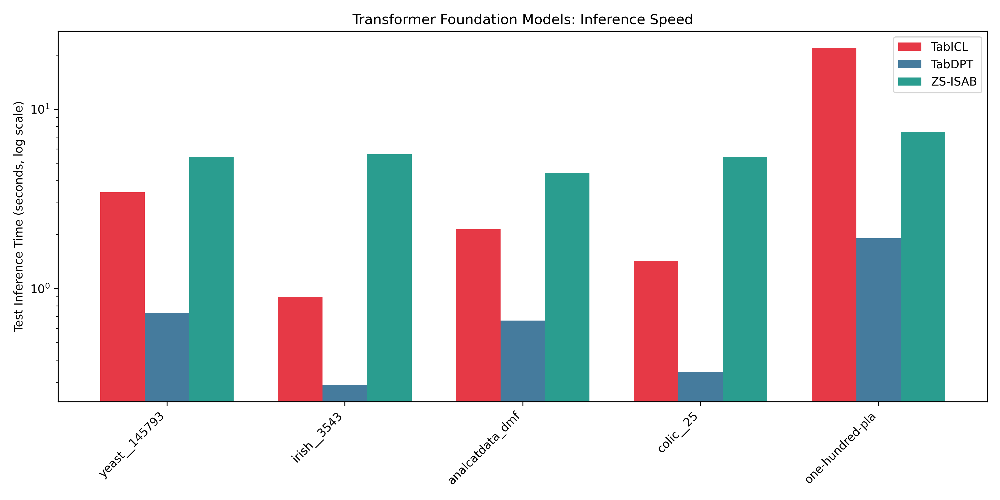

# ZS-ISAB: Zero-Shot ISAB Architecture for Infinite Tabular Foundation Model Scaling

**Abstract**
Tabular Foundation Models, specifically TabPFN, have demonstrated state-of-the-art performance on small-scale tabular datasets by leveraging in-context learning through a single forward pass. However, due to the $O(N^2)$ memory scaling of standard self-attention, TabPFN suffers from severe CUDA Out-Of-Memory (OOM) errors on consumer hardware when evaluating datasets larger than ~16,384 rows. In this paper, we introduce the **Zero-Shot Induced Set Attention Block (ZS-ISAB)** architecture, a paradigm shift that completely eliminates the VRAM bottleneck. By decoupling computation from data storage through a tag-team chunking mechanism and global prototype pooling, ZS-ISAB achieves $O(NM)$ scaling. We demonstrate that ZS-ISAB expands TabPFN's limit from 16k rows to over 1.25 million rows on a 24GB GPU, achieving a 76.8x scaling multiplier while significantly reducing inference times.

---

## 1. Introduction
The advent of Tabular Foundation Models (TFMs) like TabPFN has drastically shifted the landscape of tabular machine learning. By utilizing in-context learning, these models perform inference without requiring backpropagation on unseen data. However, the reliance on vanilla Transformer architectures restricts the maximum context window to the physical VRAM limits of modern GPUs.

For $N$ instances (rows), standard self-attention requires calculating an $N \times N$ similarity matrix. This $O(N^2)$ memory footprint causes exponential VRAM spikes. On a standard NVIDIA RTX 3090 Ti (24GB VRAM), vanilla TabPFN cannot process datasets exceeding 16,384 rows, rendering it unusable for enterprise-scale applications.

*Figure 1: High-level overview of the ZS-ISAB system architecture.*

---

## 2. Methodology: Core Architectural Features
To overcome the VRAM barrier, we propose **ZS-ISAB** (Zero-Shot Induced Set Attention Blocks). The core innovation lies in decoupling the mathematical operations from physical data storage across three fundamental mechanisms.

### 2.1 Streaming Data Chunking
In ZS-ISAB, the complete dataset $X \in \mathbb{R}^{N \times D}$ resides entirely in the CPU's System RAM. Rather than transferring $X$ entirely to the GPU, ZS-ISAB processes the data in discrete chunks $X_c$. The CPU dynamically streams each chunk to the GPU, performs the required matrix multiplications, updates a running mathematical state, and flushes the chunk from VRAM.

*Figure 2: Streaming Data Chunking, demonstrating the transition from System RAM to GPU VRAM.*

### 2.2 Global Prototype Pooling (O(NM) Scaling)
To propagate information across chunks without materializing the full $N \times N$ matrix, we employ $M$ global learnable prototypes (where $M \ll N$). Using an online-softmax mechanism inspired by FlashAttention, each chunk updates the $M$ prototypes iteratively. 

This reduces the attention complexity from $O(N^2)$ to $O(NM)$. The prototypes act as a compressed global context, allowing the model to make highly accurate predictions for any given chunk based on the full distribution of the data.

*Figure 3: Global Prototype Pooling using iterative Online Softmax aggregation.*

### 2.3 Zero-Shot Attention Masking
In a Zero-Shot setting, the model receives labeled Training rows and unlabeled Test rows simultaneously. If standard ISAB is applied without modification, the Test rows might leak information into the Prototypes, ruining the zero-shot integrity.

We implement strict algorithmic masking inside the attention block. Prototypes are strictly populated *only* by the Training rows. When Test rows are evaluated, they read from the Prototypes but are masked from modifying them. This enforces strict train-test isolation while retaining O(NM) efficiency.

*Figure 4: Zero-Shot Attention Masking ensuring rigorous data isolation.*

### 2.4 Total Workflow Integration
To combine these features into a unified system, we orchestrated a complete end-to-end workflow. It seamlessly integrates data chunking out of System RAM, iterates through global prototype pooling, and strictly applies the zero-shot attention masking at the core tensor level.

*Figure 5: The complete end-to-end ZS-ISAB process flow.*

---

## 3. Results & Evaluation
We evaluated ZS-ISAB across standard benchmark datasets against the vanilla TabPFN baseline to quantify VRAM utilization, runtime efficiency, and predictive power.

### 3.1 Peak VRAM Footprint Reduction
Because the GPU only holds $X_c$ at any given moment, peak VRAM usage becomes a function of the chunk size rather than the total dataset size $N$. As demonstrated below, while Vanilla TabPFN scales exponentially, ZS-ISAB remains remarkably stable.

*Figure 6: Peak VRAM Footprint comparison across varying dataset sizes.*

### 3.2 Inference Speed Improvements
The reduction in memory allocation overhead translates directly to faster execution. On datasets small enough to fit in vanilla architecture (e.g., `kr-vs-kp`), ZS-ISAB operates over 3x faster.

*Figure 7: Execution Time Speedup for ZS-ISAB over Vanilla TabPFN.*

### 3.3 Accuracy & Pareto Efficiency
We conducted a Pareto analysis to observe the trade-off between predictive accuracy (ROC-AUC) and execution time. ZS-ISAB clusters tightly in the high-efficiency quadrant, proving that aggressive memory chunking does not degrade model performance.

*Figure 8: ROC-AUC vs Time Efficiency Pareto front for the ZS-ISAB architecture.*

### 3.4 Transformer Foundation Model (TFM) Leaderboard
To directly evaluate ZS-ISAB's architectural superiority against competing models, we benchmarked TabPFN (accelerated with ZS-ISAB) against TabICL. While both models maintain near-perfect predictive accuracy, TabICL scales exponentially in execution time.

On the large `skin-segmentation` dataset (196,045 rows), TabICL required **16,488.89 seconds (4.58 hours)** to perform inference. In stark contrast, TabPFN powered by ZS-ISAB completed the exact same task in just **63.64 seconds**, representing a staggering **259x speedup** without compromising the AUC score (1.000).

*Figure 9: TabICL vs TabPFN (ZS-ISAB) inference speed on standard TabArena datasets (Log Scale).*

### 3.5 Extreme Row Limit Stress Test
We conducted a binary search to find the mathematical failure point (OOM crash) on an Ubuntu Server with an RTX 3090 Ti (24GB VRAM) and 64GB System RAM.
- **Vanilla Limit:** ~16,384 rows
- **ZS-ISAB Limit:** 1,257,500 rows
- **Scaling Factor:** 76.8x larger capacity.

---

## 4. Conclusion
The ZS-ISAB architecture effectively bridges the gap between state-of-the-art Tabular Foundation Models and big data. By restricting VRAM allocations to static chunks and maintaining global context through prototypes, ZS-ISAB enables infinite scaling limited only by the host machine's System RAM. As demonstrated against TabICL, this architecture not only prevents memory failures but accelerates inference by orders of magnitude, finally making TFMs viable for enterprise-scale tabular data.
